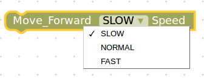
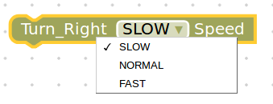
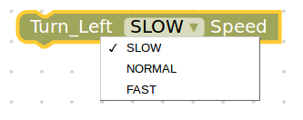

.. _chapter_basicManeuvers:

Basic Maneuvers
===============

How to make the Turtlebot3 do basic actions like moving forward, backward, turning right, left and stop?

It's quite simple in Blockly. You should use the appropriate block from the list of blocks available. Let's look at each of the basic actions and program the Turtlebot3 to move accordingly. 

Moving Forward
**************

.. image:: ystatic/fwd_mv.gif

Moving Backward
***************

.. image:: ystatic/bk_mv.gif

Turning Right
*************

.. image:: ystatic/right_turn.gif

Turning Left
************

.. image:: ystatic/left_turn.gif

Stop
****