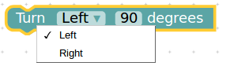
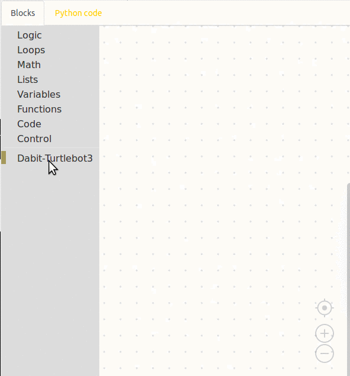

.. _chapter_basicManeuvers:

Basic Maneuvers
===============

Are you ready to make the TurtleBot3 perform basic actions like moving forward, backward, turning right, left and stop?

It's quite simple in Blockly. You just need to select the appropriate block from the list of blocks available. Let's look at each of the basic actions and program the TurtleBot3 to move accordingly. 

Moving Forward
**************

This block makes the TurtleBot3 move forward in three preset speed values - **SLOW**, **NORMAL** and **FAST** for a desired amount of time in seconds. Behind this block there is a short piece of code in `Python <https://www.python.org/>`_ that talks to the robot from the Blockly web interface and commands it to move forward with one of the preset values as programmed by the user. The figure below shows how the block is dragged into the workspace. The time and speed values are then changed. 

.. image:: _static/fwd_mv.gif

The other basic maneuver blocks of the TurtleBot3 are shown in the following figures.

Moving Backward
***************

.. image:: _static/bk_mv.gif

Turning Right
*************

.. image:: _static/right_turn.gif

Turning Left
************

.. image:: _static/left_turn.gif

Turn Left/Right in degrees
**************************

All the commands shown above move the TurtleBot3 for a desired amount of time. To turn the TurtleBot3 a specific amount (degree) you can use the **Turn Left/Right __ degrees** command. Left turn is counter-clockwise and right turn is clockwise direction. This block uses the data from an Inertial Measurement Unit (IMU) sensor.

.. image:: _static/turn_lr_deg.gif

Stop
****

You will find out how to load the program onto the TurtleBot3 and make it move, in the next page.