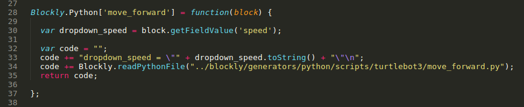

.. _chapter_blockCreation:

Block Creation - Overview
=========================

By now you have an idea that ``blocks`` are the fundamental elements in this drag and drop Blockly sofware. We will discuss how to create new blocks and/or to edit the existing ones.

This guide is adapted from Erle Robotics documentation on Block Creation and we will focus on the block creation pertaining to TurtleBot3's functionalities.

Understanding the file structure
********************************

Code changes or development typically happens inside the **blockly_ws/src/** folder.

There are four different files one should edit to create a new block.
:: 

    - turtlebot3_blockly/frontend/blockly/generators/python/scripts/turtlebot3/example.py
    - turtlebot3_blockly/frontend/blockly/generators/python/customName.js
    - turtlebot3_blockly/frontend/blockly/blocks/customName.js
    - turtlebot3_blockly/frontend/pages/blockly.html

A detailed description of the contents of these four files, in a particular order will help in creating or editing a block.

.. NOTE::
  The filenames with the ``.js`` extension must be the same.

Let's take a look at the **blockly/** directory
::

    $ cd turtlebot3_blockly/frontend/blockly/

.. NOTE::
  ``blockly`` was one of the submodules that we cloned during the software setup.

The directories **blocks/** and **generators/** contain a few files that we must edit.
Each block that you see on the Blockly web interface has its own python script that provides the block's functionality. 

The Python script
~~~~~~~~~~~~~~~~~

Let's look into the **generators/python/scripts/turtlebot3/** directory.
::

    $ cd generators/python/scripts/turtlebot3/

This directory should contain a few python scripts already. 

.. image:: ystatic/mv_fwd.png

**Move Forward** is a custom block that moves the TurtleBot3 forward in one of three speed modes - SLOW, NORMAL and FAST. A python script called ``move_forward.py`` shown below is the backend code for this block.

.. literalinclude:: pyfiles/move_forward.py
    :linenos:
    :language: python

The Javascript (Block functionality)
~~~~~~~~~~~~~~~~~~~~~~~~~~~~~~~~~~~~

The Blockly web interface needs a javascript file that can link the python script of our custom block and to describe the fields of the block. For instance, SLOW, NORMAL and FAST are one of the fields of a block. 
::

    $ cd ~/turtlebot3_blockly/frontend/blockly/generators/python/dabit-turtlebot3.js

Once the ``dabit-turtlebot3.js`` file opens, look for the particular code section written to link the **move_forward** block. It should look something similar to this image below.

The Javascript (Look and feel of the block)
~~~~~~~~~~~~~~~~~~~~~~~~~~~~~~~~~~~~~~~~~~~

In addition to the previous ``dabit-turtlebot3.js`` file there is one more with the same name inside the **blocks/** directory. Here we describe the look and feel of the block along with few other features - for instance, whether the block connects to any previous or future block(s). 
::

    $ cd ~/turtlebot3_blockly/frontend/blockly/blocks/dabit-turtlebot3.js

.. image:: ystatic/js_screenshot.png

The HTML
~~~~~~~~

Update the ``blockly.html`` file to reflect the changes of our custom block in the Blockly web interface.

The ``<category>`` tag contains the block details and below is an image that shows the contents of it.

.. image:: ystatic/blocklyHTML.png 

Now that you have an idea of what files to edit, let's look at the specifics of a block creation in the next page.

