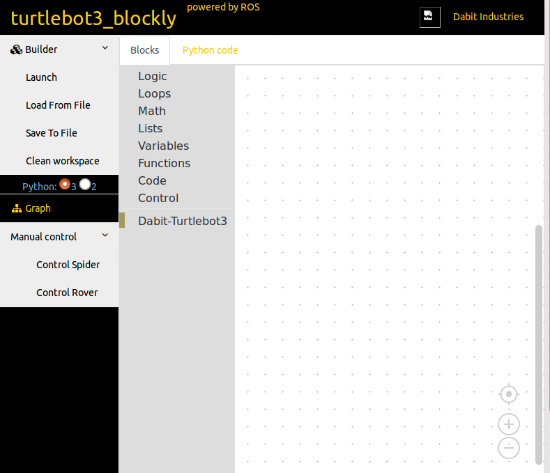

.. _chapter_launchBlockly:

Launch Blockly web interface
============================

Once the software package is setup there are a few commands to launch the Blockly web interface. Open terminal and type the following commands and leave the terminal running.
::

    $ cd ~/blockly_ws
    $ source devel_isolated/setup.bash
    $ roslaunch turtlebot3_blockly turtlebot3_blockly.launch

.. NOTE::
  To launch the web interface of blockly, you don't necessarily have to start ``roscore`` but you should if you plan to connect TurtleBot3 and test it during development.

Open a web browser and type ``127.0.0.1:1036`` in the address bar. The Blockly web interface should open and will look like the image below.

