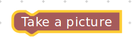
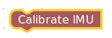

.. _chapter_specificBlock:

Specifics of Block Creation
===========================

Blocks are of three types:

1. Block with an input
2. Block with an output
3. Block without an input or output

We looked at the ``.js`` files in the previous section. We should edit them to categorize these blocks into the three types as mentioned as above. Let's go over these types in detail.

Block with an input
*******************

To create a block with an input the two ``.js`` files to be edited are:

* turtlebot3_blockly/frontend/blockly/generators/python/customName.js
* turtlebot3_blockly/frontend/blockly/blocks/customName.js

We will be looking at the same example of **move_forward** block.
The file inside ../generators/python/customName.js has the following code.
::

    Blockly.Python['move_forward'] = function(block) {

    var dropdown_speed = block.getFieldValue('speed');

    var code = "";
    code += "dropdown_speed = \"" + dropdown_speed.toString() + "\"\n";
    code += Blockly.readPythonFile("../blockly/generators/python/scripts/turtlebot3/move_forward.py");
    return code;

    };

The code snippet above takes in a value for speed {SLOW, NORMAL or FAST} from the user.
::

    var dropdown_speed = block.getFieldValue('speed');

The ``.js`` file in the location ../blockly/blocks/customName.js has the following code
::

    Blockly.Blocks['move_forward'] = {
      init: function() {
        this.appendDummyInput()
            .appendField("Move_Forward ")
            .appendField(new Blockly.FieldDropdown([["SLOW", "SLOW"], ["NORMAL", "NORMAL"], ["FAST", "FAST"]]), "speed")
            .appendField("Speed");
        this.setPreviousStatement(true);
        this.setNextStatement(true);    
        this.setColour(65);
        this.setTooltip('');
        this.setHelpUrl('http://erlerobotics.com/docs/Robot_Operating_System/ROS/Blockly/Intro.html');
      }
    };

Apart from the input of the speed value from the user, we also see the following:
::

    this.setPreviousStatement(true);
    this.setNextStatement(true); 

These two lines give the block a way to conenct to previous and future blocks.

.. image:: ystatic/mv_fwd.png

For instance

.. image:: ystatic/blockstogether.png

The **repeat** block is connected to the **move_forward** block which is again connected to the **Wait** block.

The python script for the group of blocks is
::

    for count in range(2):
      dropdown_speed = "SLOW"
      import rospy, sys
      import time
      from geometry_msgs.msg import Twist

      pub = rospy.Publisher('cmd_vel', Twist, queue_size=10)
      #rospy.init_node('circle_mode', anonymous=True)
      rate = rospy.Rate(10) # 10Hz
      twist = Twist()
      start = time.time()
      flag=True #time flag
      # Angular velocity = linear velocity / radius
      speed=dropdown_speed # SLOW, NORMAL, FAST
      twist.linear.z = 0.00
      
      # CLOCKWISE rotation
      if speed =='SLOW':
          twist.linear.y = 0.05
          twist.linear.x = 0.05
      elif speed =='NORMAL':
          twist.linear.y = 0.25
          twist.linear.x = 0.25
      elif speed == 'FAST':
          twist.linear.y = 0.75
          twist.linear.x = 0.75
      while not rospy.is_shutdown() and flag:
          sample_time=time.time()
          if ((sample_time - start) > 3):
            flag=False
          pub.publish(twist)
      twist = Twist()
      pub.publish(twist)
      rate.sleep()
      import time
      time.sleep(3)

Block with an output
********************

A block that does not take any input from the user but will have an output.
A generic example of a clicking a picture with a camera module fixed to the turtlebot3.

The first ``.js`` file's code would look like
::

    Blockly.Python['take_a_picture'] = function(block) {

    window.open(
        '/pages/images/imageViewer.html',
        '_blank' // <- This is what makes it open in a new window.
    );

    var code = "";
    code += Blockly.readPythonFile("../blockly/generators/python/scripts/brain/take_a_picture.py");
    return code;

    };

And the other ``.js`` file would have the following code
::

    Blockly.Blocks['take_a_picture'] = {
      init: function() {
        this.appendDummyInput()
            .appendField("Take a picture");
        this.setPreviousStatement(true);
        this.setNextStatement(true);
        this.setColour(0);
        this.setTooltip('');
        this.setHelpUrl('http://erlerobotics.com/docs/Robot_Operating_System/ROS/Blockly/Intro.html');
      }
    }; 

Block without an input or output
********************************

A block that typically configures some backend functionality without the need for an input or produce any output to the screen or on the robot.

An example would be to calibrate the IMU (Inertial Measurement Unit)

which doesn't necessarily have to take an input or produce an output, but simply calibrate the IMU with values hardcoded during the configuration.

And the two ``.js`` files
::

    Blockly.Python['calibrate_imu'] = function(block) {

    var code = "";
    code += Blockly.readPythonFile("../blockly/generators/python/scripts/brain/calibrate_imu.py");
    return code;

    };

::

    Blockly.Blocks['calibrate_imu'] = {
      init: function() {
        this.appendDummyInput()
            .appendField("Calibrate IMU");
        this.setPreviousStatement(true);
        this.setNextStatement(true);
        this.setColour(0);
        this.setTooltip('');
        this.setHelpUrl('http://erlerobotics.com/docs/Robot_Operating_System/ROS/Blockly/Intro.html');
      }
    };

